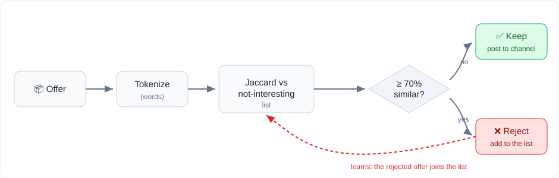
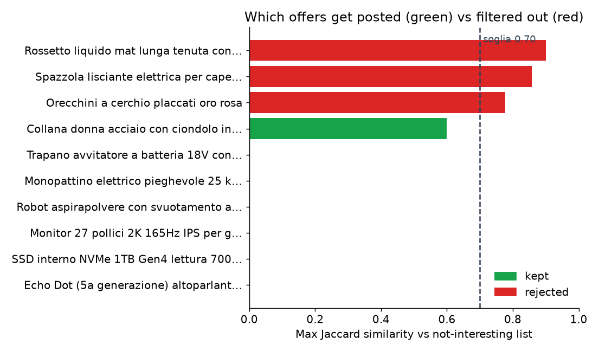

# prezzipazzi-filter

A small tool that filters Amazon offers before they go out to a Telegram deals channel, dropping the
ones that aren't worth posting (fashion, beauty, jewellery, random gadgets and so on).

It's a simple instance based filter (k nearest neighbour). Each offer's text is compared to a list of
products you've marked as not interesting, using the Jaccard similarity of their words. If an offer is at
least 70% similar to something in the list, it gets dropped and added to the list, so the filter keeps
growing from what it sees.



## Use

```bash
# print the offers worth posting (input: a JSON array of strings, or of {title, description})
python -m prezzipazzi_filter data/sample_offers.json

# try it without touching the list
python -m prezzipazzi_filter data/sample_offers.json --no-learn
```

From Python:

```python
from prezzipazzi_filter import OfferFilter

f = OfferFilter("data/not_interesting.json")      # threshold is 0.70 by default
keep, score = f.is_interesting("Echo Dot con Alexa, sconto 45%")
good = f.select(offers)                            # returns the keepers, learns from the rest
```

Drop `is_interesting()` into your bot right before it sends an offer.

On the sample offers it keeps the tech deals and throws out the fashion, beauty and jewellery. Each bar
is how similar an offer is to the not interesting list, and anything past the 0.70 line gets dropped:



## Files

* `data/not_interesting.json` is the starting list of products to skip. Edit it however you like.
* `prezzipazzi_filter/filter.py` has the Jaccard similarity and the `OfferFilter`.
* `prezzipazzi_filter/text.py` is the tokeniser (lowercase, Italian stop words removed).

## Tuning

`--threshold 0.6` is more aggressive, `0.8` is stricter about what counts as similar.

One thing to keep an eye on: rejected offers are added to the list automatically, so over time it can
drift and start dropping things you'd actually want. Open `data/not_interesting.json` every now and then
and take out anything that slipped in by mistake.

## Tests

No external dependencies, just the standard library.

```bash
pip install pytest
pytest
```

## License

[MIT](LICENSE)
